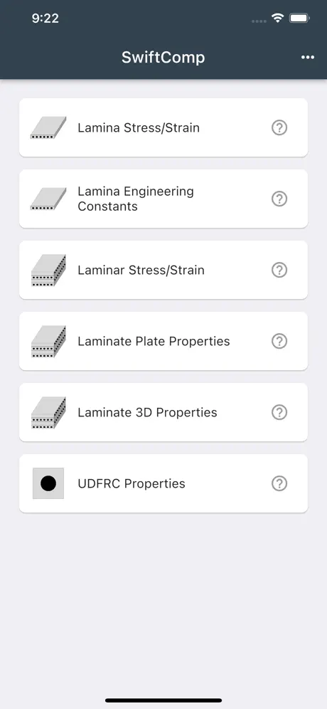
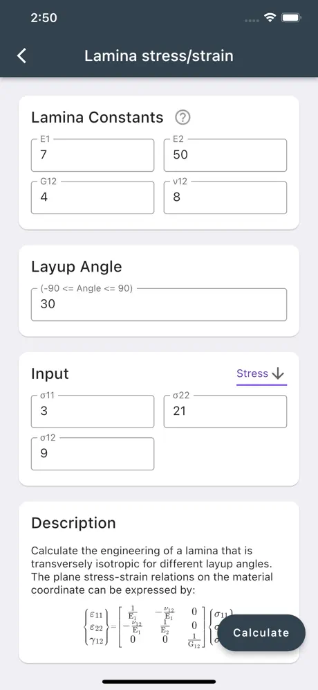
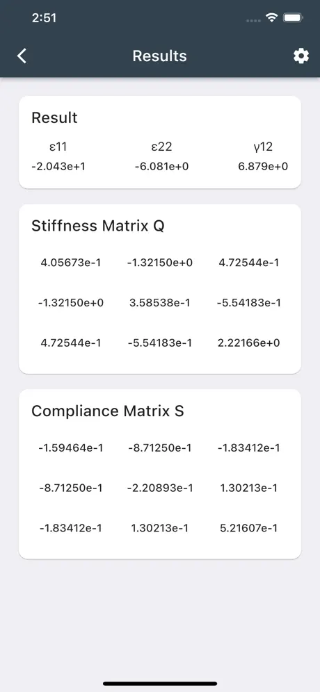

# SwiftComp-flutter

SwiftComp-flutter is a mobile application designed to provide a comprehensive composite calculator based on the SwiftComp software, an efficient multiscale modeling tool for composites. The app is available on both the App Store and Google Play Store, making it accessible to a wide range of users.

## Features

- **Lamina Stress/Strain:** Calculate stress and strain for lamina layers.
- **Lamina Engineering Constants:** Determine the engineering constants for individual lamina.
- **Laminar Stress/Strain:** Analyze stress and strain across multiple lamina layers.
- **Laminate Plate Properties:** Compute the properties of laminate plates.
- **Laminate 3D Properties:** Evaluate the three-dimensional properties of laminate materials.
- **UDFRC Properties:** Calculate the properties for user-defined fiber-reinforced composites (UDFRC).
- **Chat (Coming Soon):** A built-in AI expert chat feature is currently under development.

## Requirements

- Dart: >=3.3.0 <4.0.0
- Flutter: >=3.19.0

## Installation

### iOS
Download SwiftComp from the [App Store](https://apps.apple.com/us/app/swiftcomp-composite-calculator/id1297825946).

### Android
Download SwiftComp from the [Google Play Store](https://play.google.com/store/apps/details?id=com.banghuazhao.swiftcomp&hl=en_US).

## Screenshots

## Usage

1. **Select a Material:** Choose from the existing material database or add a new material.
2. **Input Parameters:** Enter the necessary parameters for your composite material.
3. **Calculate:** Press the calculate button to obtain results.
4. **View Results:** The app provides detailed information on the composite's properties.
5. **Chat:** A built-in AI expert chat feature is currently under development.

## Contributing
Contributions are welcome! Please read our [Contributing Guidelines](CONTRIBUTING.md) before submitting a pull request.

## License
SwiftComp-flutter is released under the MIT License. See [LICENSE](LICENSE) for details.
