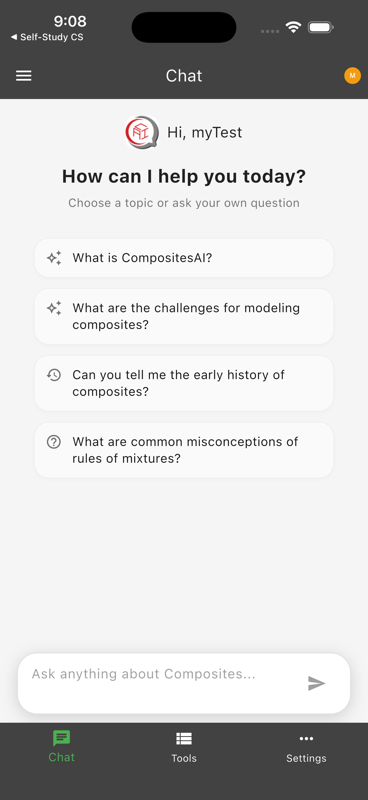
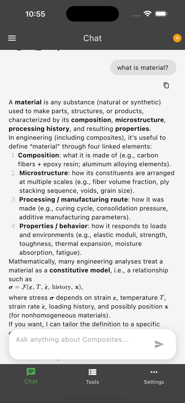
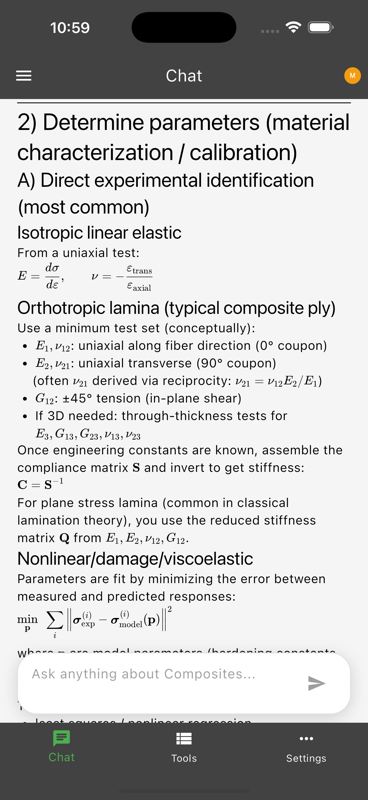
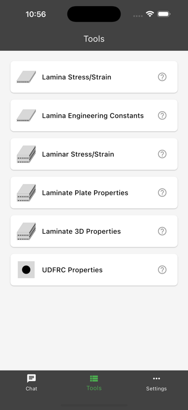

# CompositesAI

[](https://github.com/banghuazhao/CompositesAI-flutter/releases)
[](#)
[](https://apps.apple.com/us/app/compositesai-ai-for-engineers/id1297825946)
[](https://play.google.com/store/apps/details?id=com.banghuazhao.swiftcomp&hl=en_US)

> **Note:** This repository was previously known as [swiftcomp-flutter](https://github.com/banghuazhao/swiftcomp-flutter) and the app as SwiftComp. It was renamed to CompositesAI to better reflect the AI-first direction of the project.

CompositesAI is an AI-powered platform designed specifically for the composites engineering industry. Ask questions about material design, calculations, and process optimization in natural language — and get instant, expert-level answers.

The app is available for iOS, Android, and the web at [compositesai.com](https://compositesai.com/).

## Features

- AI chat assistant for composites engineering — ask anything and get domain-specific answers instantly.
- Voice input — dictate questions hands-free.
- Image and file attachments — add context to your conversations.
- Lamina stress/strain calculator for a single layer with arbitrary fiber orientation.
- Lamina engineering constants calculator.
- Laminate stress/strain calculator.
- Laminate plate properties calculator, including ABD matrices.
- Laminate 3D properties calculator.
- UDFRC rules-of-mixtures calculator for unidirectional fiber-reinforced composites.
- Account flows for sign in, sign up, password reset, profile settings, and provider sign-in.
- Localized UI for English, Simplified Chinese, and Traditional Chinese.

## Screenshots

<p align="center">
  
  
  
  
</p>

## Tech Stack

- Flutter and Dart
- Provider for app state
- GetIt for dependency injection
- Local packages for domain, data, infrastructure, and shared UI components
- `composite_calculator` for composite mechanics calculations
- `speech_to_text` for voice input
- `image_picker` for photo and file attachments
- Fastlane metadata and lanes for mobile release workflows

## Requirements

- Flutter stable. CI currently uses Flutter `3.41.7`.
- Dart `>=3.3.0 <4.0.0`.
- Xcode and CocoaPods for iOS builds.
- Android Studio or Android SDK tooling for Android builds.

The repository includes an `.fvmrc` that tracks the Flutter stable channel. If you use FVM:

```bash
fvm install
fvm flutter pub get
```

## Project Structure

```text
lib/
  app/                  App shell and dependency injection
  generated/            Generated localization files
  l10n/                 ARB localization sources
  presentation/         Chat, tools, auth, and settings UI
  util/                 Shared app utilities
packages/
  domain/               Use cases, entities, and repository contracts
  data/                 Repository implementations and API-facing data logic
  infrastructure/       Auth, HTTP, token, feature flag, and platform services
  ui_components/        Shared reusable UI widgets
test/                   App-level widget and view model tests
integration_test/       Integration test entry point
android/                Android app and Fastlane config
ios/                    iOS app and Fastlane config
```

## Getting Started

1. Clone the repository:

```bash
git clone https://github.com/banghuazhao/CompositesAI-flutter.git
cd CompositesAI-flutter
```

2. Create local configuration files as needed. At minimum, local development and CI expect a `.env` file to exist:

```bash
touch .env
```

The app also declares `msal_config.json` as an asset for Microsoft authentication. Keep environment-specific credentials out of commits.

3. Install dependencies:

```bash
flutter pub get
```

4. Run the app:

```bash
flutter run
```

Select an iOS simulator, Android emulator/device, or supported web target when prompted.

## Quality Checks

Run the same checks used by CI:

```bash
flutter analyze --no-fatal-infos --no-fatal-warnings
flutter test
```

## Downloads

- [Download CompositesAI from the App Store](https://apps.apple.com/us/app/compositesai-ai-for-engineers/id1297825946)
- [Download CompositesAI from Google Play](https://play.google.com/store/apps/details?id=com.banghuazhao.swiftcomp&hl=en_US)
- [Use CompositesAI online](https://compositesai.com/)

## Contributing

Contributions are welcome. Please read [CONTRIBUTING.md](CONTRIBUTING.md) before submitting a pull request.

## License

CompositesAI is released under the MIT License. See [LICENSE](LICENSE) for details.
